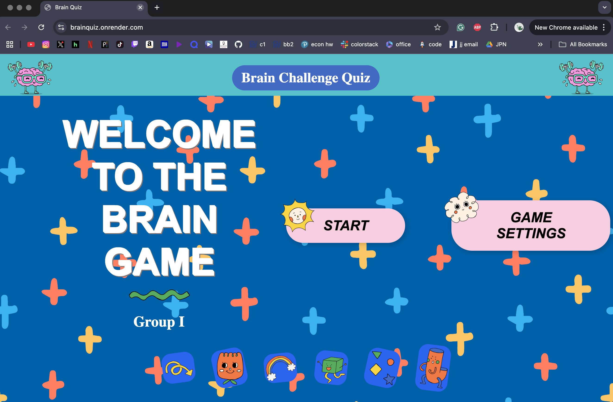
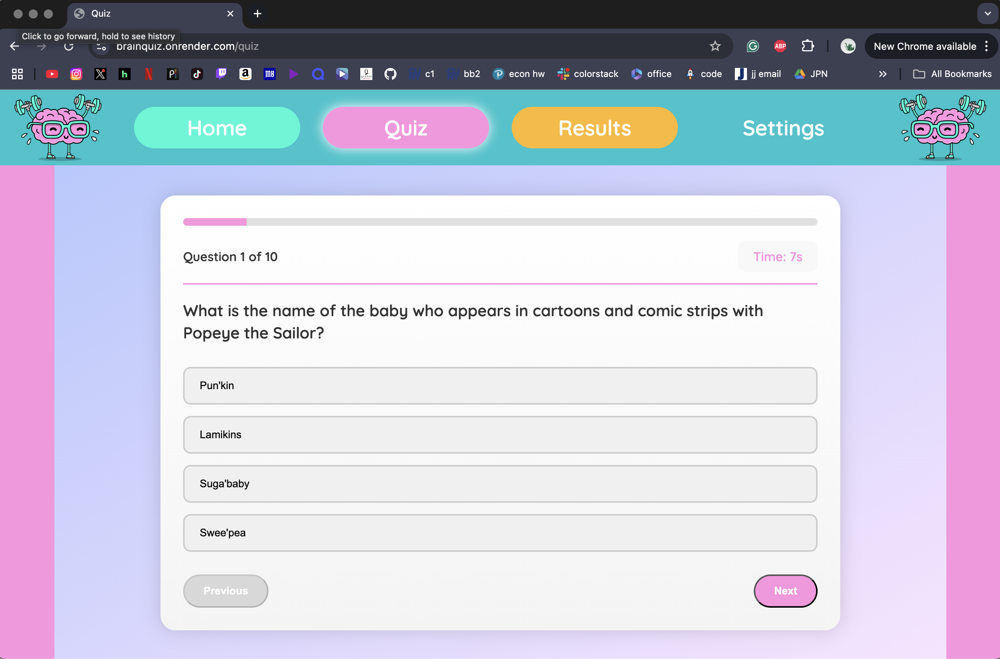
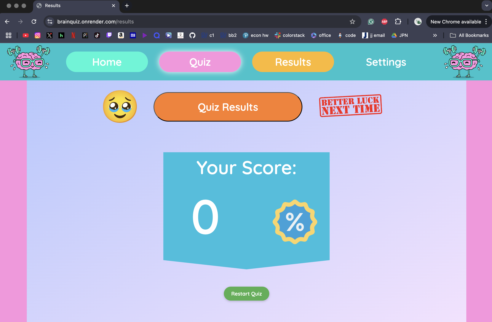
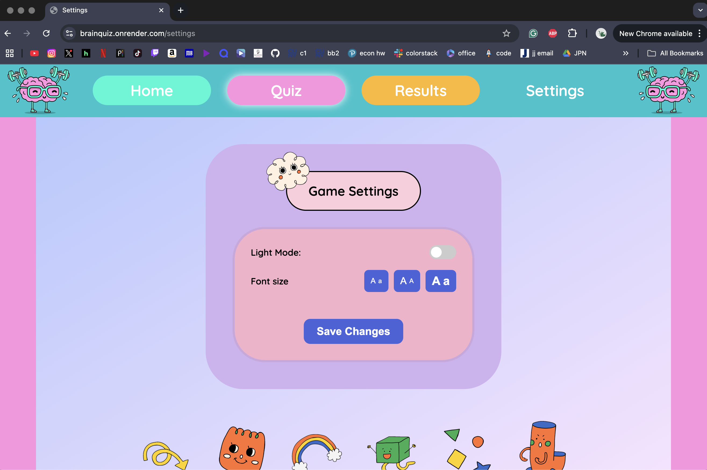

# Quiz App

A web-based Quiz Application developed collaboratively by our team as part of the course project. The app allows users to take quizzes, view results, and track performance.

---

## ✨ Features

- **Dynamic Quizzes**: Questions are randomized each time to ensure fairness and variety.
- **Theme Customization**: Toggle between light and dark mode for a personalized experience.
- **Font Control**: Choose your preferred font style to improve readability.
- **Smart Results Page**: The results page dynamically adjusts based on user score—providing customized feedback.

---

## 🖥️ How to run the server
If you are doing it locally:
  1. Download the files in this GitHub repository.
  2. Make sure you download node.js first ( https://nodejs.org/en/download). Download and install it for your operating system.
  3. Open your terminal and go to the project folder (use 'cd' to get to your directory)
  4. Install dependencies (insert "npm install" in the terminal)
  5. Lastly, in your terminal run it by typing "npm start" 
If you click the website link you don't have to do anything. 

---

## 👩‍💻 Team Members & Roles

- *Faiza*: I worked on the HTML and CSS for the questions and results pages. Made the design layout for the loading page. Worked on the JavaScript for the settings page and the questions page. Assisted in the JavaScript for the results page. 
- *Hanya*: I worked on the HTML, CSS and JS of the settings page. I also assisted with the CSS and HTML of the results page as well and added to the Quiz and Results page's JS to apply the saved settings to there. 
- *Jude*: I worked on the JS of the quiz Page. I also assisted on the HTML and CSS for the quiz and results page. I made the design layout for the navigation bar on the quiz and results page.
- *Maira*: For this project, I developed and designed the homepage using CSS, EJS, and JavaScript. I also implemented the transition page Faiza designed that appears before the questions begin. Since the original version was built with plain HTML, CSS, and JS, I migrated the entire codebase to Express.js and handled all routing to ensure smooth navigation between pages. As part of the routing logic, I also implemented a system to prevent question repetition when users retake the quiz. Additionally, I contributed to the results page by adding a restart feature to allow users to start the quiz over.

## Website Photos

